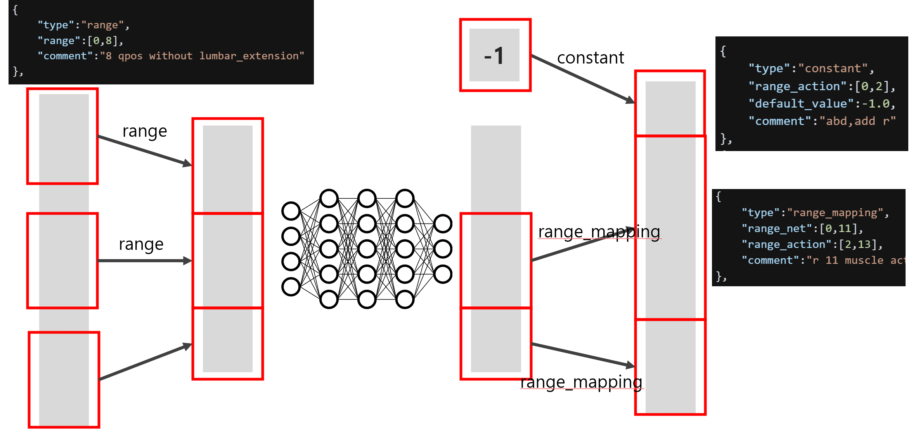

# Installation
```
pip install -e .
```

# Tutorial

You can find a step-by-step tutorial in the following Jupyter notebook:

[docs/rl_tutorial.ipynb](rl_tutorial.ipynb)


# Start training
[train bash examples](../train_bash_examples.md)

## Configuration


- `policy_params.custom_policy_params`
    --
    
    >TODO: need some figure here

    - `.net_arch`
        --
        Define network architecture(MLP)
        ```json
        "net_arch": {
                        "human_actor": [64, 64],
                        "exo_actor": [32, 8],
                        "common_critic": [64, 64]
                    },
        ```

        The `net_arch` field defines the architecture of the neural networks used for each component (human_actor, exo_actor, common_critic).
        For example, `"exo_actor": [32, 8]` means that the exo_actor network consists of two fully connected (MLP) layers: the first layer has 32 nodes, and the second layer has 8 nodes.

    - `.net_indexing_info`
        --
        
        - `.human_actor`
        - `.exo_actor`
        - `.common_critic`
            
            common critic as only `observation`
        - `[network_name].observation`: list
            ```json
            "observation":
                [
                    {
                        "type":"range",
                        "range":[0,8],
                        "comment":"8 qpos without lumbar_extension"
                    },

                    ...

                    {
                        "type":"range",
                        "range":[43,44],
                        "comment":"target velocity"
                    }
                ],
            ```
            concatenate elements in list as one observation
            `range` is index of observation
        - `[network_name].action`: list
        ```json
        "action":
            [
                {
                    "type":"constant",
                    "range_action":[0,2],
                    "default_value":-1.0,
                    "comment":"abd,add r"
                },
                {
                    "type":"range_mapping",
                    "range_net":[0,11],
                    "range_action":[2,13],
                    "comment":"r 11 muscle activation without exo; 0:2 are for abd,add"
                },

                ...
            ]
        ```
        - `constant`: input constant value as `default_value`
        - `range_net`: index of output of actor network
        - `range_action`: index of action input
- Exo off
    - [exo off config file](myoassist_rl/rl_train/train_configs/imitation_tutorial_22_separated_net_exo_off.json)
    ```json
    "action":
        [
            {
                "type":"range_mapping",
                "range_net":[0,2],
                "range_action":[26,28],
                "comment":"2 for exo L, R"
            },
            {
                "type":"constant",
                "range_action":[26,28],
                "default_value":1.0,
                "comment":"override exo"
            }
        ],
    ```
    `constant` override the `range_mapping` because it is placed later than `range_mapping`
- `env_params`
    - `env_id`: (str) Environment ID to specify which environment to use.
    - `num_envs`: (int) Number of parallel environments for training.
    - `seed`: (int) Random seed for reproducibility.
    - `safe_height`: (float) Minimum pelvis height to consider the agent safe.
    - `out_of_trajectory_threshold`: (float) Threshold for deviation from reference trajectory.
    - `flag_random_ref_index`: (bool) Whether to randomly select the starting index in the reference trajectory.
    - `control_framerate`: (int) Control frequency (Hz) for the agent's actions.
    - `physics_sim_framerate`: (int) Physics simulation frequency (Hz).
    - `min_target_velocity`: (float) Minimum target velocity for the agent.
    - `max_target_velocity`: (float) Maximum target velocity for the agent.
    - `min_target_velocity_period`: (int) Minimum period (in steps) for which the target velocity is held constant.
    - `max_target_velocity_period`: (int) Maximum period (in steps) for which the target velocity is held constant.
    - `enable_lumbar_joint`: (bool) Whether to enable the lumbar joint in the model.
    - `lumbar_joint_fixed_angle`: (float) Fixed angle for the lumbar joint if it is disabled.
    - `lumbar_joint_damping_value`: (float) Damping value for the lumbar joint.
    - `observation_joint_pos_keys`: (list of str) List of joint position (qpos) keys to include in the observation.
    - `observation_joint_vel_keys`: (list of str) List of joint velocity (qvel) keys to include in the observation.
    - `terrain_type`: (str) Type of terrain in the environment (e.g., "flat").
    - `reward_keys_and_weights`: (dict) Dictionary specifying the reward components and their corresponding weights.
    - `custom_max_episode_steps`: (int) Maximum number of steps per episode.
    - `model_path`: (str) Path to the MuJoCo model XML file.
    - `reference_data_path`: (str) Path to the reference gait data file (e.g., .npz).
    - `reference_data_keys`: (list of str) Keys from the reference data to use for imitation.
    - `prev_trained_policy_path`: (str or null) Path to a previously trained policy for transfer learning or initialization.

# Terrain
- 
## Pure RL

## Imitation Learning

## Transfer learning

- [pretrained models](../pretrained_models/)

# Code Structure
- [models](../myosuite/simhive/myoassist_sim/)
    - [myoLeg22_2D_TUTORIAL.xml](../myosuite/simhive/myoassist_sim/myoLeg22_2D_TUTORIAL.xml)  
      *2D leg model with 22 muscles for tutorial*
    - [myoLeg26_TUTORIAL.xml](../myosuite/simhive/myoassist_sim/myoLeg26_TUTORIAL.xml)  
      *3D leg model with 26 muscles for tutorial*

- [environments](../myoassist_rl/envs/)
    - [myoassist_leg_base.py](../myoassist_rl/envs/myoassist_leg_base.py)  
      *Base environment for MyoAssist leg models*
    - [myoassist_leg_imitation.py](../myoassist_rl/envs/myoassist_leg_imitation.py)  
      *Imitation learning environment*
    - [myoassist_leg_imitation_exo.py](../myoassist_rl/envs/myoassist_leg_imitation_exo.py)  
      *Imitation environment with exoskeleton*

- [RL training](../myoassist_rl/rl_train/)
    - [analyzer](../myoassist_rl/rl_train/analyzer/)
        - [gait_analyze.py](../myoassist_rl/rl_train/analyzer/gait_analyze.py)  
          *Gait analysis tools*
        - [gait_data.py](../myoassist_rl/rl_train/analyzer/gait_data.py)  
          *Gait data processing*
        - [gait_evaluate.py](../myoassist_rl/rl_train/analyzer/gait_evaluate.py)  
          *Gait evaluation functions*
        - [train_analyzer.py](../myoassist_rl/rl_train/analyzer/train_analyzer.py)  
          *Training analysis utilities*
        - [train_log_analyzer.py](../myoassist_rl/rl_train/analyzer/train_log_analyzer.py)  
          *Training log analysis*
        - [train_log_handler.py](../myoassist_rl/rl_train/analyzer/train_log_handler.py)  
          *Training log management*
    - [rl_agents](../myoassist_rl/rl_train/rl_agents/)
        - [network_index_handler.py](../myoassist_rl/rl_train/rl_agents/network_index_handler.py)  
          *Handles network output indices*
        - [rl_agent_base.py](../myoassist_rl/rl_train/rl_agents/rl_agent_base.py)  
          *Base RL agent class*
        - [rl_agent_exo.py](../myoassist_rl/rl_train/rl_agents/rl_agent_exo.py)  
          *RL agent for exoskeleton*
        - [rl_agent_human.py](../myoassist_rl/rl_train/rl_agents/rl_agent_human.py)  
          *RL agent for human model*
    - [train_configs](../myoassist_rl/rl_train/train_configs/)
        - [base.json](../myoassist_rl/rl_train/train_configs/base.json)  
          *Base training configuration*
        - [imitation_tutorial_22_separated_net_partial_obs.json](../myoassist_rl/rl_train/train_configs/imitation_tutorial_22_separated_net_partial_obs.json)  
          *Config for 22-muscle imitation tutorial*
        - [imitation_tutorial_22_separated_net_exo_off.json](../myoassist_rl/rl_train/train_configs/imitation_tutorial_22_separated_net_exo_off.json)  
          *Config for 22-muscle imitation, exo off*
        - [imitation_tutorial_26_separated_net.json](../myoassist_rl/rl_train/train_configs/imitation_tutorial_26_separated_net.json)  
          *Config for 26-muscle imitation tutorial*
    - [utils](../myoassist_rl/rl_train/utils/)
        - [config.py](../myoassist_rl/rl_train/utils/config.py)  
          *General configuration utilities*
        - [config_imitation.py](../myoassist_rl/rl_train/utils/config_imitation.py)  
          *Imitation-specific configuration*
        - [myoassist_leg_imitation_exo.py](../myoassist_rl/envs/myoassist_leg_imitation_exo.py)  
          *Imitation exo environment config (only here)*


# Modify Code
- reward function
    1. add new reward function to get_reward_dict
    2. Add weight to json
    3. Add weight to TrainSessionConfigBase.EnvParams.RewardWeights
        - TrainSessionConfigBase.EnvParams.RewardWeights
        - ImitationTrainSessionConfig.EnvParams.RewardWeights

