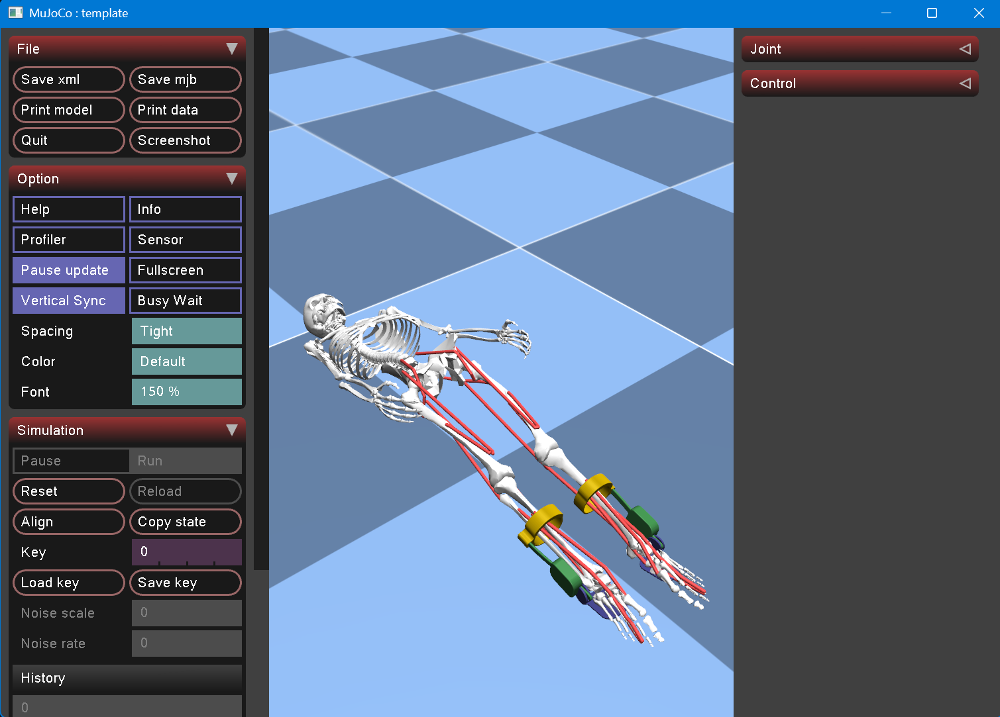

# Reinforcement Learning

MyoAssist’s reinforcement learning (RL) pipeline is built on top of **Stable-Baselines3 (SB3) PPO** and a set of custom MuJoCo environments that simulate human–exoskeleton interaction. This page gives you a bird’s-eye view of how everything fits together and where to find more information.

<div style="display: flex; justify-content: center; align-items: center; gap: 24px;">
  <div style="flex: 1; text-align: center;">
    
    <!-- <div>Flat Terrain</div> -->
  </div>
  <div style="flex: 1; text-align: center;">
    
    <!-- <div>Rough Terrain</div> -->
  </div>
</div>

---


<!-- ## Core Building Blocks

| Layer | File / Doc | Description |
|-------|------------|-------------|
| **Environment** | [`envs/`](../../rl_train/envs/) · [Getting Started](getting_started.md) | MuJoCo-based Gym environments that expose observations, rewards and actions. |
| **Trainer** | [`run_train.py`](../../rl_train/run_train.py) · [Code Structure](code_structure.md) | Loads a JSON config, constructs vectorised envs and launches SB3 PPO. |
| **Callback** | [`learning_callback.py`](../../rl_train/utils/learning_callback.py) | Handles logging, checkpoints, videos and curriculum switches. |
| **Analyzer** | [`analyzer/`](../../rl_train/analyzer/) · [Network Index Handler](network-index-handler.md) | Post-hoc evaluation: plots, gait metrics and network indexing analysis. |
| **Configuration** | [`train_configs/*.json`](../../rl_train/train/train_configs/) · [Configuration Guide](configuration.md) | Fully define terrain, reward weights, network indexing and SB3 hyper-parameters. | -->

---

## Training Workflow

1. **Define a config** – start from an existing JSON preset or create one from scratch.
2. **Launch training**
   ```bash
   python rl_train/run_train.py --config_file_path rl_train/train_configs/my_config.json
   ```
3. **Monitor progress** – logs & results in `results/train_session_*`.
4. **Evaluate policy** –
   ```bash
   python rl_train/run_policy_eval.py results/train_session_<timestamp>
   ```
5. **Analyze results** – automatic plots + gait metrics saved under `analyze_results/`.

---

## Key Features

- **Multi-Actor Support** – Separate networks for human muscles and exoskeleton actuators (see [Network Index Handler](network-index-handler)).
- **Terrain Curriculum** – Train on a progression of terrains from flat to rough ([Terrain Types](terrain-types)).
- **Reference Motion Imitation** – Optional imitation reward using ground-truth gait trajectories.
- **Realtime Evaluation** – Run policies in realtime with `--flag_realtime_evaluate`.

---


# Getting Started

This guide shows you the fastest way to test the RL system and run training in the MyoAssist RL system.

## RL Training Folder Structure

Here is a quick overview of the main entry point scripts in the [`rl_train`]({{ site.github.repository_url }}/tree/{{ site.repo_branch }}/rl_train/) folder:

| File | Purpose |
|------|---------|
| [`run_simulation.py`]({{ site.github.repository_url }}/blob/{{ site.repo_branch }}/rl_train/run_simulation.py) | The simplest way to create and test a MyoAssist RL environment. No training, just environment creation and random actions. |
| [`run_train.py`]({{ site.github.repository_url }}/blob/{{ site.repo_branch }}/rl_train/run_train.py) | Main entry point for running RL training sessions. Loads configuration, sets up environments, and starts training. |
| [`run_policy_eval.py`]({{ site.github.repository_url }}/blob/{{ site.repo_branch }}/rl_train/run_policy_eval.py) | Entry point for evaluating and analyzing trained policies. Useful for testing policy performance and generating analysis results. |

### Folder Structure


## Quick Test Commands

### 1. Environment Creation Example

See how to create a simulation environment and run for 150 frames(5sec):

```bash
python rl_train/run_simulation.py
```

- mac:
```bash
mjpython rl_train/run_simulation.py
```
> **Note:**
If you need MuJoCo visualizer in mac os, simply use `mjpython` instead of `python` to run your script.  
You do not need to install anything extra—just change the command:

> **Note:**  
If you see the error message `ModuleNotFoundError: No module named 'flatten_dict'`, simply run the command again. This will usually resolve the problem automatically.


<!-- -->

<p align="center">
  
</p>


**What this does:**
- Shows an example of creating a Gym wrapped MuJoCo simulation environment
- No actual training - just environment creation example

### 2. Quick Training Test

Run a minimal training session to verify everything works:

```bash
python rl_train/run_train.py --config_file_path rl_train/train/train_configs/imitation_tutorial_22_separated_net_partial_obs.json --config.total_timesteps 12 --config.env_params.num_envs 1 --config.ppo_params.n_steps 4 --config.ppo_params.batch_size 4 --config.logger_params.logging_frequency 1 --config.logger_params.evaluate_frequency 1 --flag_rendering
```

**What this does:**
- Runs actual reinforcement learning training
- Training for only 12 timesteps (very fast)
- Uses 1 environment (minimal resource usage)
- Enables rendering to see the simulation
- Logs results after every rollout (4 steps) for immediate feedback

### 3. Check Results

After training, check the results folder:

```bash
# Results location
rl_train/results/train_session_[date-time]/
```
<!--  -->
<p align="center">
  
</p>

**What you'll find:**
- `analyze_results_[timesteps]_[evaluate_number]`: Training analysis results
- `session_config.json`: Configuration used for this training
- `train_log.json`: Training log data

## Full Training (When Ready)

Once you've verified everything works, run full training:

- windows:
```bash
python rl_train/run_train.py --config_file_path rl_train/train/train_configs/imitation_tutorial_22_separated_net_partial_obs.json
```

- mac:
```bash
mjpython rl_train/run_train.py --config_file_path rl_train/train/train_configs/imitation_tutorial_22_separated_net_partial_obs.json
```

This file is the default example configuration we provide.  
For more details, see the [Understanding Configuration](./configuration.html) section.


## Policy Evaluation

Test a trained model:

```bash
python rl_train/run_policy_eval.py [path/to/trainsession/folder]
```

**Example (evaluating with a pretrained model we provide):**
```bash
python rl_train/run_policy_eval.py docs/assets/tutorial_rl_models/train_session_20250728-161129_tutorial_partial_obs
```


After training, an `analyze_results` folder will be created inside your `train_session` directory.  
This folder contains various plots and videos that visualize your agent's performance.

- **Where to find:**  
  ```
  rl_train/results/train_session_[date-time]/analyze_results/
  ```
- **What's inside:**  
  - Multiple plots (e.g., reward curves, kinematics, etc.)
  - Videos
  <p align="center">
    
  </p>


The parameters used for evaluation and analysis (such as which plots/videos are generated) are controlled by the `evaluate_param_list` in your `session_config.json` file.

For more details on how to customize these parameters, see the [Understanding Configuration](./configuration.html) section.

## Realtime Policy Running
You can run a trained policy in realtime simulation:
<!--  -->
<p align="center">
  
</p>

- windows:
```bash
python rl_train/run_train.py --config_file_path [path/to/config.json] --config.env_params.prev_trained_policy_path [path/to/model_file] --flag_realtime_evaluate
```

- mac:
```bash
mjpython rl_train/run_train.py --config_file_path [path/to/config.json] --config.env_params.prev_trained_policy_path [path/to/model_file] --flag_realtime_evaluate
```


**Parameters:**
- `[path/to/config.json]`: Path to the JSON file in the train_session folder
- `[path/to/model_file]`: Path to the model file (.zip) without extension. It is located in the train_models folder
<!--  -->
<p align="center">
  
</p>

**Example (evaluating with a pretrained model we provide):**
- windows:
```bash
python rl_train/run_train.py --config_file_path docs/assets/tutorial_rl_models/train_session_20250728-161129_tutorial_partial_obs/session_config.json --config.env_params.prev_trained_policy_path docs/assets/tutorial_rl_models/train_session_20250728-161129_tutorial_partial_obs/trained_models/model_19939328 --flag_realtime_evaluate
```
- mac:
```bash
mjpython rl_train/run_train.py --config_file_path docs/assets/tutorial_rl_models/train_session_20250728-161129_tutorial_partial_obs/session_config.json --config.env_params.prev_trained_policy_path docs/assets/tutorial_rl_models/train_session_20250728-161129_tutorial_partial_obs/trained_models/model_19939328 --flag_realtime_evaluate
```
